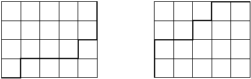

# Paths on a Grid

Imagine you are attending your math lesson at school. Once again, you are bored because 
your teacher tells things that you already mastered years ago (this time he's explaining
that _(a+b)2=a2+2ab+b2_). So you decide to waste your 
time with drawing modern art instead.

Fortunately you have a piece of squared paper and you choose a rectangle of size _n×m_ on 
the paper. Let's call this rectangle together with the lines it contains a grid. Starting 
at the lower left corner of the grid, you move your pencil to the upper right corner, 
taking care that it stays on the lines and moves only to the right or up. The result is 
shown on the left:

Really a masterpiece, isn't it? Repeating the procedure one more time, you arrive with the 
picture shown on the right. Now you wonder: how many different works of art can you produce?

## Input Specification

The input contains several test cases. Each is specified by two unsigned 32-bit integers _n_ 
and _m_, denoting the size of the rectangle. As you can observe, the number of lines of the 
corresponding grid is one more in each dimension. Input is terminated by _n_ and _m=0_. 
_Rectangles of width or height of 0 (but not both) are permitted._

## Output Specification

For each test case output on a line the number of different art works that can be generated 
using the procedure described above. That is, how many paths are there on a grid where each 
step of the path consists of moving one unit to the right or one unit up? You may safely 
assume that this number fits into a 32-bit unsigned integer.

## Sample Input

    5 4
    1 1
    0 0

## Sample Output

    126
    2

_All input is on the standard input stream; write all output to the standard output stream._

> Attribution: http://cs.fit.edu/~ryan/fun/grid.html
