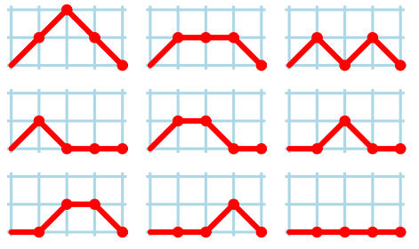

#Delta Wave

> _A delta wave is a high amplitude brain wave in humans with a frequency of 1 - 4 hertz
> which can be recorded with an electroencephalogram (EEG) and is usually associated with
> slow-wave sleep (SWS)._
>
> _-- from Wikipedia_

Researchers have discovered a new kind of species called "[otaku](http://en.wikipedia.org/wiki/Otaku)", 
whose brain waves are quite strange. The delta brain waves for the otaku can be 
approximated by a polygonal line in the 2D coordinate system. The line is a route from 
point (0, 0) to (_N_, 0), and it is moves only to the right (up, down or straight) at 
every step. It never dips below the x axis.

For example, here are all 9 kinds of delta waves for _N_ = 4:

Given N, you are asked to find out how many kinds of different delta waves an otaku has.

## Input

There will be no more than 20 test cases. There is only one line for each case, containing
an integer _N_ (2 < _N_ ≤ 10000)

## Output

Output one line for each test case. Because the answer may be quite large, you need only 
output the answer modula 10100.

## Sample Input

    3
    4
   
## Sample Output

    4
    9
    
> Attribution: http://cs.fit.edu/~ryan/fun/wave.html
